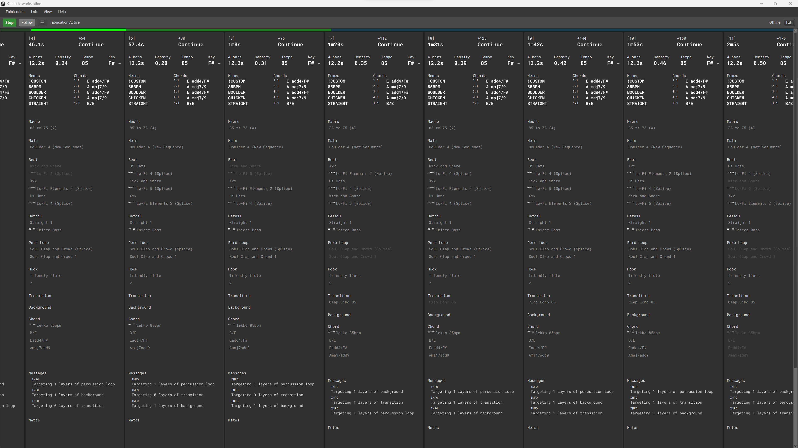

# Adaptive music engine

XJ music enables composers to realize new possibilities in adaptive music for video games.

XJ includes the [XJ music workstation](https://github.com/xjmusic/xjmusic/tree/main/workstation), a DAW dedicated to preparing adaptive video game music, and the 
[XJ music engine](https://github.com/xjmusic/xjmusic/tree/main/engine) to integrate the product within your game audio system.

Download and install the XJ music workstation on your computer to start creating adaptive music for video games. The latest version of the XJ music workstation can be downloaded from [xjmusic.com/download](https://xjmusic.com/download).

  

## Patented technology, open source codebase

The underlying technology is protected by [U.S. Patent 10,446,126](https://patents.google.com/patent/US10446126B1/)
You may use the XJ music engine completely free for projects with a budget under $250K.
For larger projects, contact licensing@xjmusic.com for a license.

